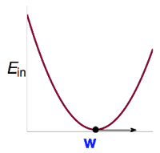
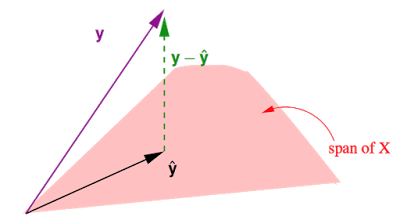
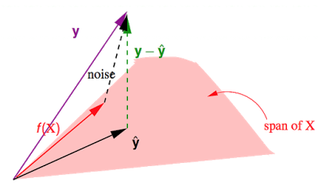
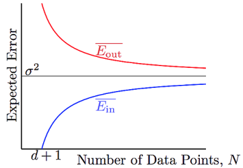

&emsp;&emsp;前面花了很大篇幅在说机器为何能学习，接下来要说的是机器是怎么学习的，进入算法$$\mathcal{A}$$的部分。[上一篇](http://beader.me/2014/03/02/noise-and-error/)稍微提到了几个error的衡量方式，接下来的几篇笔记要讲的就是各种error measurement的区别以及针对它们如何设计最优化的算法。通过设计出来的算法，使得机器能够从$$\mathcal{H}$$(Hypothesis Set)当中挑选可以使得cost function最小的$$h$$作为$$g$$输出。

&emsp;&emsp;本篇以众所周知的线性回归为例，从方程的形式、误差的衡量方式、如何最小化$$E_{in}$$的角度出发，并简单分析了Hat Matrix的性质与几何意义，希望对线性回归这一简单的模型有个更加深刻的理解。

# 方程的形式：

$$
h(x)=\sum_{i=\color{red}{0}}^d w_ix_i= w^Tx \\\
$$

&emsp;&emsp;长得很像perceptron(都是直线嘛)，perceptron是$$h(x)=sign(w^Tx)$$。

# 误差的衡量 — 平方误差(squared error)：

$$
\begin{matrix}
err(\hat{y}_n,y_n) = (\hat{y}_n-y_n)^2\\\
(\hat{y}_n\text{为预测值，}y_n\text{为真实值})
\end{matrix}
$$

# Cost function：

$$
E_{in}(w)=\frac{1}{N}\sum_{n=1}^N(\hat{y}_n - y_n)=\frac{1}{N}\sum_{n=1}^N(w^Tx_n-y_n)^2
$$

&emsp;&emsp;$$h(x)$$是一个以$$x$$为变量的方程，而$$E_{in}(w)$$变成了一个以$$w$$为变量的方程。这样一来，我们就把“在$$\mathcal{H}$$中寻找能使平均误差最小的方程”这个问题，转换为“求解一个函数的最小值”的问题。使得$$E_{in}(w)$$最小的$$w$$，就是我们要寻找的那个最优方程的参数。

# 如何最小化$$E_{in}(w)$$：

&emsp;&emsp;用矩阵形式表示：

$$
\begin{aligned}
E_{in}(\color{blue}{w}) &= \frac{1}{N}\sum_{n=1}^{N}(\color{blue}{w^T}\color{red}{x_n}-\color{purple}{y_n})^2=\frac{1}{N}\sum_{n=1}^{N}(\color{red}{x_n^T}\color{blue}{w}-\color{purple}{y_n})^2 \\\

&=\frac{1}{N}\begin{Vmatrix}
\color{red}{x_1^T}\color{blue}{w}-\color{purple}{y_1}\\\
\color{red}{x_2^T}\color{blue}{w}-\color{purple}{y_2}\\\
...\\\
\color{red}{x_N^T}\color{blue}{w}-\color{purple}{y_N}
\end{Vmatrix}^2 \\\

&=\frac{1}{N}\begin{Vmatrix}
\color{red}{\begin{bmatrix}
--x_1^T--\\\
--x_2^T--\\\
...\\\
--x_N^T--
\end{bmatrix}}
\color{blue}{w} -
\color{purple}{\begin{bmatrix}
y_1\\\
y_2\\\
...\\\
y_3
\end{bmatrix}}
\end{Vmatrix}^2 \\\

&=\frac{1}{N}||
\underbrace{\color{red}{X}}_{N\times d+1}\;\;\;
\underbrace{\color{blue}{w}}_{d+1\times 1} \; - \;
\underbrace{\color{purple}{y}}_{N\times 1}
||^2

\end{aligned}
$$

&emsp;&emsp;$$\color{red}{X}$$与$$\color{purple}{y}$$来源于$$\mathcal{D}$$，是固定不变的，因此它是一个以$$\color{blue}{w}$$为变量的函数。我们需要解使得$$E_{in}$$最小的$$\color{blue}{w}$$，即$$\underset{\color{blue}{w}}{min}\,E_{in}(\color{blue}{w})=\frac{1}{N}\begin{Vmatrix}\color{red}{X}\color{blue}{w}-\color{purple}{y}\end{Vmatrix}^2$$。这个$$E_{in}(\color{blue}{w})$$是一个连续(continuous)、处处可微(differentiable)的凸函数(convex)：

   &emsp;&emsp;

&emsp;&emsp;对于这一类函数，只需要解其一阶导数为0时的解即可。

$$
E_{in}(\color{blue}{w}) \equiv
\begin{bmatrix}
\frac{\partial E_{in}}{\partial \color{blue}{w}_0}(\color{blue}{w})\\\
\frac{\partial E_{in}}{\partial \color{blue}{w}_1}(\color{blue}{w})\\\
...\\\
\frac{\partial E_{in}}{\partial \color{blue}{w}_d}(\color{blue}{w})
\end{bmatrix}=\begin{bmatrix}
\color{orange}{0}\\\
\color{orange}{0}\\\
...\\\
\color{orange}{0}
\end{bmatrix}
$$

&emsp;&emsp;关于多元函数的求导，就是线性代数的范畴了：

$$
\boxed
{
\begin{matrix}
\text{一元的情况}\\\
\\\
E_{in}(\color{blue}{w})=\frac{1}{N}(\color{red}{a}\color{blue}{w^2}-2\color{brown}{b}\color{blue}{w}+\color{purple}{c})\\\
\nabla E_{in}(\color{blue}{w})=\frac{1}{N}(2\color{red}{a}\color{blue}{w}-2\color{brown}{b})
\end{matrix}
}
\xrightarrow{\text{推广至}}
\boxed{
\begin{matrix}
\text{多元的情况}\\\
\\\
E_{in}(\color{blue}{w})=\frac{1}{N}(\color{blue}{w^T}\color{red}{A}\color{blue}{w}-2\color{blue}{w^T}\color{brown}{b}+\color{purple}{c})\\\
\nabla E_{in}(\color{blue}{w})=\frac{1}{N}(2\color{red}{A}\color{blue}{w}-2\color{brown}{b})
\end{matrix}
}
$$

&emsp;&emsp;所以有：

$$
\begin{aligned}
\nabla E_{in}(\color{blue}{w}) &=\nabla \frac{1}{N}(\color{blue}{w^T}\color{red}{X^TX}\color{blue}{w}-2\color{blue}{w^T}\color{brown}{X^Ty}+\color{purple}{y^Ty}) \\\
&=\frac{2}{N}(\color{red}{X^TX}\color{blue}{w}-\color{brown}{X^Ty})
\end{aligned}
$$

&emsp;&emsp;令$$\nabla E_{in}(\color{blue}{w})=0$$，可得最佳解：

$$
\color{blue}{w_{LIN}}=\underbrace{(\color{red}{X^TX})^{-1}\color{red}{X^T}}_{pseudo-inverse\;\color{red}{X^{\dagger}}}\;\;\;\color{purple}{y} = \color{red}{X^{\dagger}} \color{purple}{y}
$$

&emsp;&emsp;当$$\color{red}{X^TX}$$可逆的时候用它作为pseudo-inverse矩阵$$\color{red}{X^{\dagger}}$$，当$$\color{red}{X^TX}$$不可逆的时候，再用其他方式定义$$\color{red}{X^{\dagger}}$$，这里就不详述了。

&emsp;&emsp;用以$$\color{blue}{w_{LIN}}$$为参数的线性方程对原始数据做预测，可以得到拟合值$$\hat{y}=\color{red}{X}\color{blue}{w_{LIN}}=\color{red}{XX^{\dagger}}\color{purple}{y}$$。这里又称$$\color{orange}{H}=\color{red}{XX^{\dagger}}$$为Hat Matrix，帽子矩阵，$$\color{orange}{H}$$为$$\color{purple}{y}$$带上了帽子，成为$$\hat{y}$$，很形象吧。

# Hat Matrix 的几何意义

&emsp;&emsp;这张图展示的是在N维实数空间$$\mathbb{R}^N$$中，注意这里是N=数据笔数，$$\color{purple}{y}$$中包含所有真实值，$$\hat{y}$$中包含所有预测值，与之前讲的输入空间是d+1维是不一样的噢。$$\color{red}{X}$$中包含d+1个column：

 - $$\hat{y}=\color{red}{X}\color{blue}{w_{LIN}}$$是$$\color{red}{X}$$的一个线性组合，$$\color{red}{X}$$中每个column对应$$\mathbb{R}^N$$下的一个向量，共有d+1个这样的向量，因此$$\hat{y}$$在这d+1个向量所构成的$$\color{red}{span}$$(平面)上。
 - 事实上我们要做的就是在这个平面上找到一个向量$$\hat{y}$$使得他与真实值之间的距离$$|\color{green}{y-\hat{y}}|$$最短。不难发现当$$\hat{y}$$是$$\color{purple}{y}$$在这个平面上的投影时，即$$\color{green}{y-\hat{y}}\perp \color{red}{span}$$时，$$|\color{green}{y-\hat{y}}|$$最短。
 - 所以之前说过的Hat Matrix $$\color{orange}{H}$$，为$$\color{purple}{y}$$戴上帽子，所做的就是投影这个动作，寻找$$\color{red}{span}$$上$$\color{purple}{y}$$的投影。
 - $$\color{orange}{H}\color{purple}{y}=\hat{y}$$，$$(I-\color{orange}{H})\color{purple}{y}=\color{green}{y-\hat{y}}$$。($$I$$为单位矩阵)

&emsp;&emsp;下面来探究一下$$\color{orange}{H}$$的性质，这个很重要噢。

$$
\text{Hat Matrix }\color{orange}{H} = \color{red}{X(X^TX)}^{-1}\color{red}{X^T}
$$

 - 对称性(symetric)，即$$\color{orange}{H}=\color{orange}{H^T}$$：

$$
\begin{aligned}
\color{orange}{H^T} &= (\color{red}{X(X^TX)}^{-1}\color{red}{X^T})^T \\\
&=\color{red}{X({(X^TX)}^{-1})^TX^T} \\\
&=\color{red}{\color{red}{X(X^TX)}^{-1}\color{red}{X^T}}\\\
&=\color{orange}{H}
\end{aligned}
$$

 - 幂等性(idempotent)，即$$\color{orange}{H^2}=\color{orange}{H}$$：

$$
\begin{aligned}
\color{orange}{H^2} &= (\color{red}{X(X^TX)}^{-1}\color{red}{X^T})(\color{red}{X(X^TX)}^{-1}\color{red}{X^T})\\\
&=\color{red}{X\;}\underbrace{\color{red}{(X^TX)}^{-1}\color{red}{(X^TX)}}_{I}\;\color{red}{(X^TX)}^{-1}\color{red}{X^T} \\\
&=\color{red}{X}\color{red}{(X^TX)}^{-1}\color{red}{X^T}\\\
&=\color{orange}{H}
\end{aligned}
$$

 - 半正定(positive semi-definite)，即所有特征值为非负数：
(以下$$\lambda$$为特征值，$$b$$为对应的特征向量)

$$
\begin{aligned}
\color{orange}{H}b&=\lambda b\\\
\color{orange}{H^2}b&=\lambda \color{orange}{H}b \\\
&=\lambda (\lambda b)\\\
\text{(因为}\color{orange}{H^2}&=\color{orange}{H}\text{)}\\\
\color{orange}{H^2}b&=\color{orange}{H}b=\lambda b\\\
\text{所以}&:\\\
\lambda ^2b&=\lambda b \\\
\text{即}&:\\\
\lambda (\lambda -1)b&=0 \\\
\lambda = 0 &\text{ or } \lambda=1
\end{aligned}
$$

&emsp;&emsp;林老师在课堂上讲到：

$$
trace(I-\color{orange}{H}) = N-(d+1)
$$

&emsp;&emsp;$$trace$$为矩阵的迹。这条性质很重要，但是为什么呢？证明过程有点多，以后有机会再补充，心急的同学可以看这里[General formulas for bias and variance in OLS][4]。一个矩阵的$$trace$$等于该矩阵的所有特征值(Eigenvalues)之和。

&emsp;&emsp;假设$$\color{purple}{y}$$由$$\color{red}{f(X)\in span}+noise$$构成的。有$$\color{purple}{y}=\color{red}{f(X)}+noise$$。之前讲到$$\color{orange}{H}$$作用于某个向量，会得到该向量在$$\color{red}{span}$$上的投影，而$$I-\color{orange}{H}$$作用于某个向量，会得到那条与$$\color{red}{span}$$垂直的向量，在这里就是图中的$$\color{green}{y-\hat{y}}$$，即$$(I-\color{orange}{H})noise=\color{green}{y-\hat{y}}$$。

&emsp;&emsp;这个$$\color{green}{y-\hat{y}}$$是真实值与预测值的差，其长度就是就是所有点的平方误差之和。于是就有：

$$
\begin{aligned}
E_{in}(\color{blue}{w_{LIN}})&=\frac{1}{N}||\color{green}{y-\hat{y}}||^2\\\
&=\frac{1}{N}||(I-\color{orange}{H})noise||^2 \\\
&=\frac{1}{N}trace(I-\color{orange}{H})||noise||^2 \\\
&=\frac{1}{N}(N-(d+1))||noise||^2
\end{aligned}
$$

&emsp;&emsp;上面的证明不太好整理进来，依然可以参考[General formulas for bias and variance in OLS](http://www.stat.berkeley.edu/~census/general.pdf)。

&emsp;&emsp;因此，就平均而言，有：

$$
\begin{aligned}
\color{red}{\overline{E_{in}}}&=\text{noise level}\cdot(1-\frac{d+1}{N})\\\
\color{blue}{\overline{E_{out}}}&=\text{noise level}\cdot(1+\frac{d+1}{N}) \;\;\;(后面这个不懂证了。)
\end{aligned}
$$

&emsp;&emsp;花这么大力气是为了什么，又回到之前learning可行性的话题了。

  

&emsp;&emsp;$$\color{red}{\overline{E_{in}}}$$和$$\color{blue}{\overline{E_{out}}}$$都向$$\sigma ^2$$(noise level)收敛，并且他们之间的差异被$$\frac{2(d+1)}{N}$$给bound住了。有那么点像VC bound，不过要比VC bound来的更严格一些。
